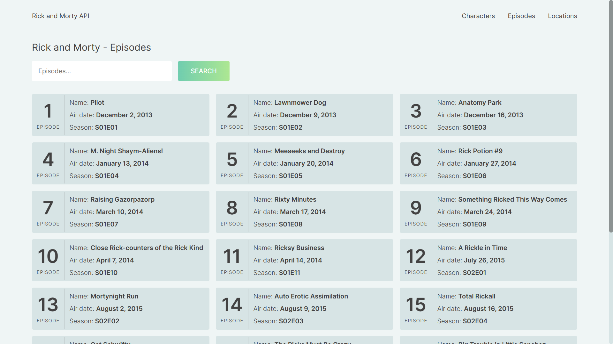
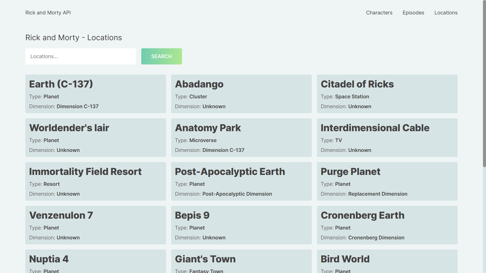
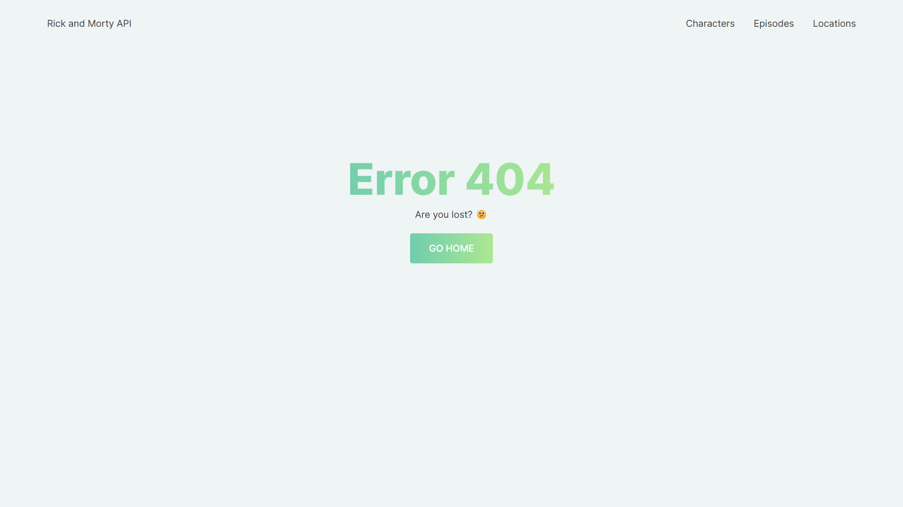

# Rick and Morty API - Data
On this web page you will find information about Rick and Morty. You can find data on their characters, their episodes and their locations. All this information is from [Rick and Morty API](https://rickandmortyapi.com/ "The Rick and Morty API is a REST and GraphQL API based on the television show Rick and Morty.").

## Technologies
This web page was made with the following technologies:
- HTML5
- CSS3
- JavaScript
- React

## Pages
This web page contains 5 sections: **Index**, **Characters**, **Episodes**, **Locations** and **Error 404**.

### Index
#### This is the home section, where you will find the synopsis of this TV series, the number of episodes it contains, as well as the number of characters and locations.

### Characters
#### In this section you can search and find your favorite Rick and Morty characters. You will find information about each character, such as whether he is alive or dead, his species, type, gender, origin, and location.

### Episodes
#### In this section you can search and find the episodes of Rick and Morty. You will find information about the name of each episode, which season it belongs to and the release date.

### Locations
#### In this section you can search and find the locations of Rick and Morty. You will find information about what type of locality it is and to what dimension it belongs.

### Error 404
#### This section is when an Error 404 occurs.

